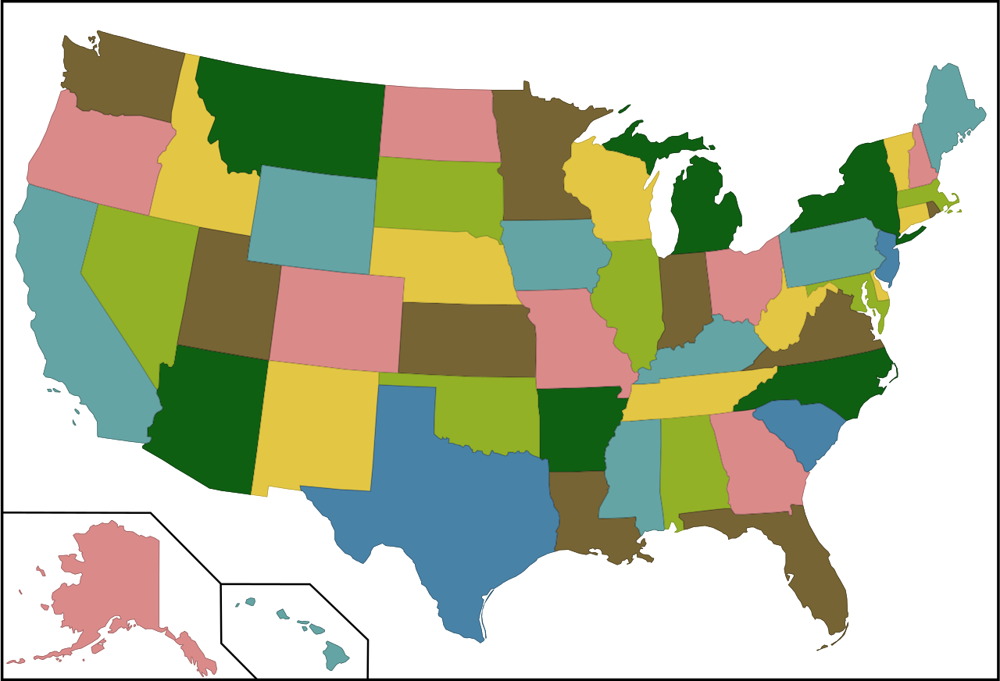

# Boolean Satisfiability Problem (SAT)

*"it is a constant source of annoyance when you come up with a clever special algorithm which then gets beaten by translation to SAT"* - Chris Jefferson 


## What are Sat solvers? 
SAT solvers are programs that solve the Boolean satisfiability problem from Boolean logic. You are given a logical expression in which the variables are either `true` or `false` and are combined with logical connectives **and**, **or**, and **not**. The question is: can you find an assignment of true and false values to the variables which makes the Boolean formula true?
The Boolean formula is either called satisfiable (SAT) or unsatisfiable (UNSAT).

For example: 
> (x1 ∧ x2) ∨ ¬x1 is satisfiable because if x1 is `false` then the boolean formula evaluates to `true`

> (x1 ∧ ¬x1) is unsatisfiable because no value of x1 can make the formula `true`

Many Constraint Satisfaction Problems (CSP) in Artificial Intelligence and Operational Research can be formulated and solved as Boolean Satisfiability Problem.
Constraint Satisfaction Problems use a set of decision variables and a set of constraints. The values of the decision variables are unknown and it only once the program has been executed that they will be assigned values. It is possible to specify variables domains. To be a valid solution the decision variables must be assigned values from variables domains that satisfy the specified constraints. The objective is to find one valid solution, or in some cases, all valid solutions. 


## The United States map coloring problem 
This problem can be solved using methods based on Satisfiability (SAT). 



We wish to color a map of the United States as shown above. The map is made up of 48 different states. Coloring this map means assigning a color to each vertex of its correponding graph with the restriction that two adjacent vertices have a different color.

### Abording the problem
Let A = {a1, a2,..., an} be a set of n > 1 Boolean variables. 
If a is a variable in A then a and ¬a are called literals over A. 
A clause C over A is a set of literals over A. It represents the disjunction of the literals, and is valid (or satisfied) under a truth assignment if and only if at least one of its literals is true under the assignment. It is invalid (or unsatisfied) under the truth assignment if every literal in it is false under the assignment. 
A set C of clauses over A is satisfiable if there exist a truth assignment for A such that every clause in C is valid under the assignment. In the Satisfiability Problem (SAT) we are required to determine whether a given set C of clauses is satisfiable. In SAT the clauses represent the constraints to be satisfied when assigning truth-values to the Boolean variables. In SAT, the number of literals in a clause can vary.

```
Vertices = {wa, or, ca, nv, id, az, ut, mt, wy, co, nm, tx, ok, ks, ne, sd, nd, mn, ia, mo, ar, la, ms, al, ga, sc, nc, fl, tn, ky, va, wv, il, in, oh, pa, wi, mi, ny, vt, nh, me, ma, ri, ct, nj, de, md};

NbEdges = 1..109;
Edges1 = [wa, wa, or, or, or, id, id, id, id, ca, ca, nv, nv, ut, ut, ut, wy, wy, wy, wy, mt, mt, az, az, co, co, co, co, ne, ne, ne, ne, sd, sd, sd, nd, nm, nm, ok, ok, ok, ok, ks, ks, mo, mo, mo, mo, mo, ia, ia, ia, mn, tx, ar, ar, ar, ar, tn, tn, tn, tn, tn, tn, ky, ky, ky, ky, ky, il, il, wi, la, ms, al, al, ga, ga, nc, nc, va, va, wv, wv, wv, oh, oh, oh, in, wi, wi, md, md, pa, pa, pa, de, nj, nj, ny, ny, ny, ny, ct, ri, ma, ma, vt, nh, ];

Edges2 = [or, id, id, ca, nv, nv, ut, wy, mt, nv, az, ut, az, az, co, wy, co, ne, sd, mt, nd, sd, nm, co, nm, ok, ks, ne, ks, mo, ia, sd, ia, mn, nd, mn, tx, ok, tx, ar, mo, ks, mo, ne, ar, tn, ky, il, ia, il, wi, mn, wi, la, la, ms, tn, mo, ms, al, ga, nc, va, ky, va, wv, oh, in, il, in, wi, mi, ms, al, fl, ga, fl, sc, sc, va, wv, md, oh, md, pa, pa, mi, in, mi, mn, mi, de, pa, de, nj, ny, nj, ct, ny, ct, ri, ma, vt, ri, ma, vt, nh, nh, me];
```

### Results
```
Each of the digit corresponds to a given color. For example a digit at the first place corresponds to color 1 whereas a digit at the 6th position corresponds to color 6.
Color of wa is 1000
Color of or is 0001
Color of ca is 1000
Color of nv is 0010
Color of id is 0100
Color of az is 0001
Color of ut is 1000
Color of mt is 1000
Color of wy is 0010
Color of co is 0100
Color of nm is 0010
Color of tx is 0100
Color of ok is 1000
Color of ks is 0010
Color of ne is 1000
Color of sd is 0001
Color of nd is 0100
Color of mn is 1000
Color of ia is 0010
Color of mo is 0100
Color of ar is 0010
Color of la is 1000
Color of ms is 0100
Color of al is 0010
Color of ga is 0100
Color of sc is 1000
Color of ncf is 0010
Color of fl is 1000
Color of tn is 1000
Color of ky is 0001
Color of va is 0100
Color of wv is 0010
Color of il is 1000
Color of ine is 0010
Color of oh is 0100
Color of pa is 0001
Color of wi is 0100
Color of mi is 1000
Color of ny is 0010
Color of vt is 1000
Color of nh is 0010
Color of me is 1000
Color of ma is 0100
Color of ri is 1000
Color of ct is 0100
Color of nj is 1000
Color of de is 0100
Color of md is 1000
```


